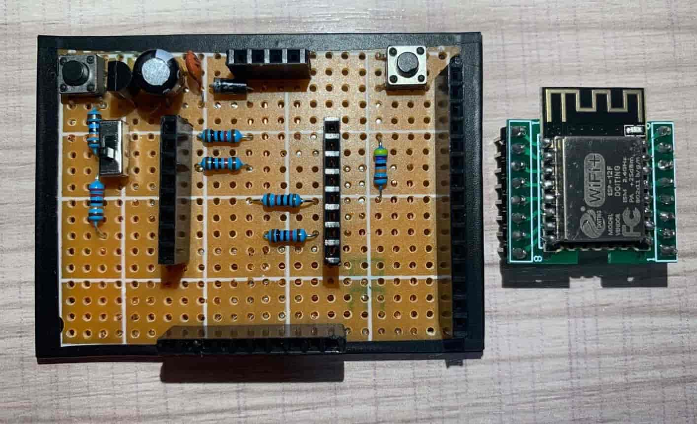
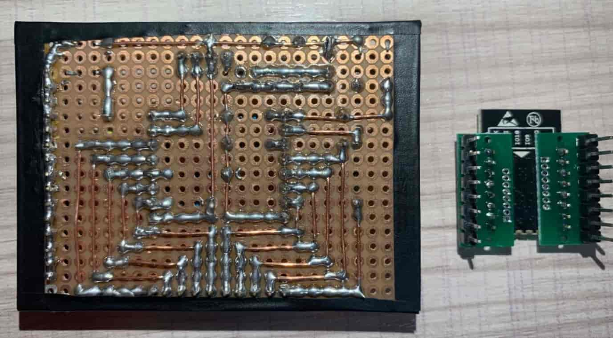

# ESP8266
Docs and projects of ESP8266 development board.

## NodeMCU Pin Definition


## How to re-run modules

```python
import sys
sys.modules
del sys.modules['test']
```

Or use *Thonny* IDE.

## ESP-12F

###







## Server

```
nohup python3 -u server.py > /dev/null 2>&1 &
```

## Web

```
nohup streamlit run web.py > web.log 2>&1 &
```

